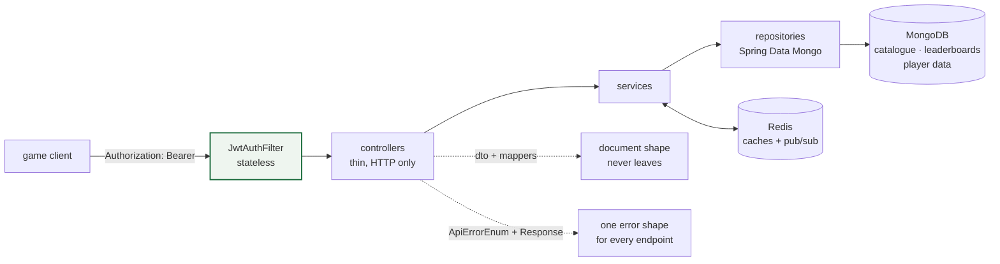

# game-center-api

A **Game Center REST API** for a portfolio of mobile games: device authentication with JWT,
player data save/load, leaderboards, match records, a game catalogue and categories - with the
API surface documented through OpenAPI/Swagger.

```bash
make up
# api      : http://localhost:8080/api/v1
# swagger  : http://localhost:8080/swagger-ui.html
```

## What this demonstrates

- **Layered Spring Boot service**: `controllers` (thin, HTTP only) → `services` → `repositories`
  (Spring Data Mongo) with `dto` request/response types and `mappers` between them, so the
  persisted document shape never leaks to the client.
- **Two datastores with different jobs**: MongoDB keeps the game catalogue, categories,
  leaderboards and player data; Redis carries the caches and the pub/sub plumbing created in
  `configs/redis`. Both are wired through their own `@Configuration`, which keeps connection
  concerns out of the business code.
- **Stateless auth**: a JWT filter (`configs/jwt/JwtAuthFilter` + `JWTSecurityConfig`) guards the
  API, so an instance can be replaced or scaled out without losing sessions.
- **Error handling as data**: `constants/ApiErrorEnum` plus a single response envelope
  (`dto/responses/Response`) means every endpoint fails in the same shape.
- **Paging and HATEOAS**: `PagingRequest` and `spring-boot-starter-hateoas` are in place for the
  list endpoints, which is what a game client needs to page through a catalogue.
- **Containerised end to end**: `Dockerfile` (maven build stage → temurin runtime) and a
  `docker-compose.yml` that brings up mongo + redis + the api with health-gated startup order.

## Endpoints

| Method | Path | Purpose |
|---|---|---|
| POST | `/api/v1/auth/register` | create an account |
| POST | `/api/v1/auth/login` | sign in, returns the JWT |
| POST | `/api/v1/auth/renew` | exchange a token for a fresh one |
| GET | `/api/v1/categories`, `/api/v1/categories/{id}` | category list / detail |
| GET | `/api/v1/games`, `/api/v1/games/{id}` | game catalogue list / detail |
| GET | `/api/v1/games/routers/{nameRouter}` | resolve a game by its router name |
| GET | `/api/v1/leaderboard/{gameId}/{type}` | leaderboard for a game and a board type |
| POST | `/api/v1/matches`, PUT `/api/v1/matches/{matchId}` | create / update a match record |
| POST | `/api/v1/users/data` | save player data |

## Quickstart

```bash
git clone https://github.com/lasttoss/game-center-api.git
cd game-center-api
make up            # mongo + redis + api, then browse to /swagger-ui.html
make logs
make down
```

Ports taken? Copy `.env.example` to `.env` and change `API_PORT` / `MONGO_PORT` / `REDIS_PORT`.

## Configuration

| environment | default | used for |
|---|---|---|
| `SERVER_PORT` | `8080` | http port |
| `SPRING_DATA_MONGO_URI` | `mongodb://localhost:27017/gamecenter` | Mongo connection (`spring.data.mongo.uri`) |
| `SPRING_DATA_REDIS_HOST` / `_PORT` / `_DATABASE` | `localhost` / `6379` / `1` | Redis |
| `JWT_SECRET` | `dev-secret-change-me` | JWT signing key - replace outside a laptop |

## Fixed while preparing this repository

1. **The application could not start from a clean clone.** `application.properties` was committed
   as `.bak`, so Spring Boot failed on the missing datasource properties. It is now a real file
   with environment placeholders.
2. **The compose file was committed as `.bak` and was incomplete** - it defined only the API
   container and expected MongoDB and Redis to already exist somewhere. The stack now starts
   both of them, with healthchecks and a health-gated start order.
3. **A signing key was committed in the `.bak` file.** Both the old value and the hardcoded
   development secret are gone; the key comes from `JWT_SECRET` and the `.bak` files are deleted
   from the repository.

## Notes / limitations

- There are no automated tests yet; the CI job builds, runs `mvn test` (currently empty) and
  builds the image.
- `quarkus-*`-style native compilation is not set up here: this is a plain JVM service.

## License

MIT - see [LICENSE](LICENSE).

## The request path as a picture



One request, drawn so the layer boundaries are visible: the filter checks a stateless token, the controller
stays on transport, the service holds the decisions, and the repository is the only thing that knows Mongo.
Alongside them are the two cross-cutting pieces the README calls out — `dto`/`mappers`, so the stored
document shape never reaches the client, and `ApiErrorEnum` with one response envelope, so every endpoint
fails in the same shape.

The two datastores are drawn with the jobs they actually have: Mongo holds what has to survive a restart and
be queried by shape, Redis holds what is safe to lose — caches and the pub/sub that carries a change to the
instances that need it.

`docs/diagrams/layered-request-path.mmd` is the Mermaid source; `make diagram` exports a PNG if a browser is
present.

## The chart

`charts/gamecenter-api/` deploys the API with what a live service needs on Kubernetes: a rolling update that
does not take a replica out of the Service (`maxUnavailable: 0`), a PodDisruptionBudget that keeps one serving
through a disruption, an HPA, a NetworkPolicy whose egress names the datastores it uses instead of allowing
everything, no service-account token, and a read-only root filesystem with an `emptyDir` for `/tmp`.

```bash
make chart     # helm lint --strict + helm template
```

## Coverage

`./mvnw -B test` runs the unit suite; these are JaCoCo's numbers, line coverage:

| class | lines |
|---|---|
| `AuthService` | 100.0% (72/72) |
| `MatchService` | 0.0% (0/49) |
| `LeaderboardService` | 0.0% (0/43) |
| `UserModel` | 84.4% (27/32) |
| `JwtUtils` | 76.7% (23/30) |
| `GameResponseData` | 35.7% (10/28) |
| `RedisService` | 0.0% (0/27) |
| `GameService` | 100.0% (27/27) |
| `LeaderboardModel` | 0.0% (0/23) |
| `GameModel` | 73.9% (17/23) |
| **total** | **29.8%** (233/783 lines, 2.1% of 996 branches) |

`AuthService` and `GameService` are covered in full, with no Spring context and no MongoDB: their
collaborators are Mockito mocks, and the password encoder is the real one, because "the stored value
is not the password" is the kind of thing a mock would agree with whatever the code did.

That sweep found three things, and they are the reason this section is longer than the table:

**Fixed:** `GameService.getItemById` ended with `setData(HttpStatus.OK.value())` where it meant
`setStatus`, so the answer to "give me this game" was the number 200 in the data field and a status of
zero. The test that reads the game back is the fix's guard.

**Recorded, not fixed - `AuthService.login` never verifies the password.** It looks the username up
and issues tokens; the encoder field is only ever used by `register`. As written, any password signs
you in as anyone whose name you know. It is left alone because adding a check would lock out every
client that signs in through this route today, and whether that route is meant to serve social logins
is a call for the service owner.

**Recorded, not fixed - `UserModel.getUsername()` and `getPassword()` are stubs that return null.**
The model implements Spring Security's `UserDetails` and satisfies two of its methods with stubs, and
Lombok does not generate a getter where one already exists - so the field holds the username and the
obvious accessor answers null. Nothing breaks today because requests are authenticated by
`JwtAuthFilter`, but any `UserDetailsService`, encoder or log line that reaches for those getters reads
null, and a test that asserts on them is testing the stub. Hence two tests that read the fields
directly and say why.

Not covered here, and what covers them instead: `MatchService`, `LeaderboardService` and
`RedisService` are next; the repositories and controllers are the data and REST layers, exercised by
the end-to-end run against the stack. `ApplicationTests` is tagged `integration` and the pom excludes
it from the unit suite - CI runs it in the job that brings up MongoDB and Redis, so it is not lost.
